# Plan détaillé : Anchoring

- [Plan détaillé : Anchoring](#plan-détaillé--anchoring)
  - [Résumé (Français)](#résumé-français)
  - [Résumé (Anglais)](#résumé-anglais)
  - [Mots-clés](#mots-clés)
  - [Introduction](#introduction)
  - [I - Présentation du Projet](#i---présentation-du-projet)
    - [1) Cadre du projet en entreprise](#1-cadre-du-projet-en-entreprise)
      - [a) Présentation de l'entreprise](#a-présentation-de-lentreprise)
      - [b) Présentation de l'environnement du projet](#b-présentation-de-lenvironnement-du-projet)
    - [2 - Objectif du projet](#2---objectif-du-projet)
      - [a) Projet de recherche](#a-projet-de-recherche)
      - [b) Domaine du projet](#b-domaine-du-projet)
    - [3) Présentation du projet : Ancrage Sémantique (Anchoring)](#3-présentation-du-projet--ancrage-sémantique-anchoring)
      - [a) Introduction au projet](#a-introduction-au-projet)
      - [b) Terminogy](#b-terminogy)
      - [c) Presentation Anchoring avec remplissage d'une ontologie](#c-presentation-anchoring-avec-remplissage-dune-ontologie)
      - [d) But du projet](#d-but-du-projet)
  - [II - Ontologie : la base de connaissance](#ii---ontologie--la-base-de-connaissance)
    - [1) Nos Besoins justifiant une ontologie + intrdoction au ontologies](#1-nos-besoins-justifiant-une-ontologie--intrdoction-au-ontologies)
    - [2) Choix du OWL](#2-choix-du-owl)
    - [3) Qu'est ce qu'on veut faire avec notre moteur ontologique](#3-quest-ce-quon-veut-faire-avec-notre-moteur-ontologique)
      - [a) Protege](#a-protege)
      - [b) OWLAPI / Jena](#b-owlapi--jena)
      - [c) Ontologenius](#c-ontologenius)
      - [d) Owlready2](#d-owlready2)
      - [e) KnowRob](#e-knowrob)
      - [f) Autre moteur d'ontologie](#f-autre-moteur-dontologie)
  - [III - Algorithme](#iii---algorithme)
    - [1) Presentation Algorithme](#1-presentation-algorithme)
      - [a) Algoritme Simple Septembre](#a-algoritme-simple-septembre)
      - [b) Algoritme Linéaire](#b-algoritme-linéaire)
    - [2) Algoritme : Ontology Manager](#2-algoritme--ontology-manager)
      - [a) Besoins](#a-besoins)
      - [b) Presenatation de l'algoritme](#b-presenatation-de-lalgoritme)
      - [c) Réduction de Ontology Manager dans le cadre du projet](#c-réduction-de-ontology-manager-dans-le-cadre-du-projet)
    - [3) Algorithme réduit : Algoritme implémenté](#3-algorithme-réduit--algoritme-implémenté)
      - [a) Explications de l'algoritme](#a-explications-de-lalgoritme)
      - [b) SYSML](#b-sysml)
      - [c) Implementation ROS Squidly](#c-implementation-ros-squidly)
  - [IV - Implementation](#iv---implementation)
    - [1) Design](#1-design)
      - [a) Role du design](#a-role-du-design)
      - [b) Choix de l'Upper Ontologie](#b-choix-de-lupper-ontologie)
      - [c) Présentation de SOMA](#c-présentation-de-soma)
      - [d) Modification de SOMA](#d-modification-de-soma)
      - [e) Ajout du Mid et du Domain](#e-ajout-du-mid-et-du-domain)
        - [i) Mid ajout de la compatibilité avec les autres Node](#i-mid-ajout-de-la-compatibilité-avec-les-autres-node)
        - [ii) Domain](#ii-domain)
      - [f) Comment le Design/domain est fait ?](#f-comment-le-designdomain-est-fait-)
    - [2) Setup](#2-setup)
      - [a) Role du setup](#a-role-du-setup)
      - [b) Comment le populator est fait ?](#b-comment-le-populator-est-fait-)
    - [3) Run Time (boucle temps réel)](#3-run-time-boucle-temps-réel)
      - [a) Role du run time](#a-role-du-run-time)
      - [b) Integrateur](#b-integrateur)
        - [i) Role de l'intégrateur](#i-role-de-lintégrateur)
        - [ii) Comment l'intégrateur est fait ?](#ii-comment-lintégrateur-est-fait-)
      - [c) Rulemaker](#c-rulemaker)
        - [i) Role du rulemaker](#i-role-du-rulemaker)
        - [ii) Comment le rulemaker est fait ?](#ii-comment-le-rulemaker-est-fait-)
      - [d) Reasonner](#d-reasonner)
        - [i) Role du reasonner](#i-role-du-reasonner)
        - [ii) Comment le reasonner est fait ?](#ii-comment-le-reasonner-est-fait-)
      - [e) Reader](#e-reader)
        - [i) Role du reader](#i-role-du-reader)
        - [ii) Comment le reader est fait ?](#ii-comment-le-reader-est-fait-)
    - [4) Conclusion de l'implémentation](#4-conclusion-de-limplémentation)
  - [V - Apprentissages, critiques, autres chose à explorer](#v---apprentissages-critiques-autres-chose-à-explorer)
    - [1) Ontologies](#1-ontologies)
    - [2) SWRL](#2-swrl)
    - [3) Moteur Ontologique](#3-moteur-ontologique)
    - [4) Algorithme](#4-algorithme)
    - [5) Design](#5-design)
    - [6) Setup](#6-setup)
    - [7) Intergrator](#7-intergrator)
    - [8) RuleMaker](#8-rulemaker)
    - [9) Reasonner](#9-reasonner)
    - [Moi-même](#moi-même)
    - [Suite a donner au projet](#suite-a-donner-au-projet)
  - [Conclusion](#conclusion)

## Résumé (Français)

Ancrage symbolique (Anchoring) processus qui transforme des données de Jumeaux numériques (fonctionnel ou géométrique) en une sémantique intelligente à l'aide d'une ontologie. Cette ontologie peut être lue pour donner des prédicats sous la forme *Sujet* *Action* *Complément*. De plus, grâce à un reasonner ontologique on peut vérifier la cohérence de l'ontologie, faire des inférences (créer des relations) et appliquer des règles. On peut ainsi dire que l'Anchoring raisonne et donc que c'est un processus intelligent. Grâce à l'Anchoring, l'ontologie est un savoir sémantique sur lequel d'autres applications peuvent interagir. Dans mon cas d'application, la robotique cognitive, le Task Planner et le jumeau numérique (Digital Twin) interagissent avec l'ontologie. Les Digital Twins permettent de remplir l'ontologie grâce à l'Anchoring (intégrateur), et l'Anchoring peut demander aux Digital Twins des informations supplémentaires si nécessaire. Le Task Planner reçoit les prédicats que fournit l'Anchoring pour créer une liste d'action pour résoudre un objectif. L'Anchoring est temps réel et donc peut s'apercevoir de problème dans les actions. De plus, l'Anchoring est basé sur une ontologie qui est créé avec une upper ontologie pour permettre à ce que ce savoir sémantique soit partageable. Nous avons vue une proposition du algorithme basé MAPEK, décentralisé pour l'utilisation de la base de connaissance. Et enfin on voit une proposition d'implémentation avec une upper ontologie : SOMA et un moteur ontologique : owlready2 en utilisant python et ros. L'exemple présenté est en intéraction avec un jumeau numérique et task planner. En conclusion nous avons une premier proposition d'implémentation et surtout nous avons appris sur les technologies utilisé et nous avons des voix d'améliorations.

## Résumé (Anglais)

Symbolic anchoring (Anchoring) process that transforms data from Digital Twins (functional or geometric) into intelligent semantics using an ontology. This ontology can be read to give predicates in the form *Subject* *Action* *Complement*. Futhermore, an ontology reasonner can be used to check the consistency of the ontology, make inferences (create relations) and apply rules.Anchoring can therefore be considered an intelligent process. Thanks to Anchoring, the ontology is a semantic knowledge on which other applications can interact. In my case study, cognitive robotics, the Task Planner and the Digital Twin interact with the ontology. The Digital Twins fill in the ontology thanks to the Anchoring (integrator), and the Anchoring can request additional information from the Digital Twins if necessary. The Task Planner receives the predicates provided by the Anchoring to create an action list to solve a goal. Anchoring is real-time, so it can spot problems in actions. Futhemore, Anchoring is based on an ontology that is created with an upper ontology to enable this semantic knowledge to be shared.

## Mots-clés

- congnitive Robotics
- Robot intélligent
- Symbolique
- Sémantique
- Ontologie
- Raisonnement
- Probleme complexe
- Ancrage
- Ancrage Symbolique
- language formel
- language de npn programmation

## Introduction

Avec l'avement de plus en plus presente de l'automatisation et d la robotique, on veut maintenant que cette robotique soit intelligente et donc qu'elle est une compréhension de son environnement et une capacité d'apprentissage. Nous avons déjà la capacité de créer des taches grace à des behaviour tree qui representent des taches complexes avec un regroupement de taches de plus en plus simple. On est aussi capable grâce à des plannificateur de taches qui avec un plan du monde et un objectif peuvent donner une liste de taches à faire pour resoudre l'objectif. Nous pouvons aussi representer le monde réel grâce à des jumeaux numériques. On cherche maintenant à créer des algorithme munie d'intélligence qui peuvent comprendre le monde et qui soit capable de raisonnement. Un algotihme capable de faire ceci serait capable de comprendre n'importe quelle situation de monde et aussi capable de raisonnement. Il pourrait ainsi servir à n'importe quelle autres processus informatique dans n'importe quelle domaine, le domaine de la finance, le domaine de la paublicité sur le web par exemple. Ce serait donc un algorithme capable de manipuler des base de connaissance et capable aussi d'en creer. On voudrait ainsi remplacer les systemes experts par des règles et des raisonnement basé sur des fait symboliques. Cette algorithme sera donc l'intelligence qui manque dans la robotique actuel.

<!--- Problématique -->
Dans ce mémoire, à été fait dans un but de recherche dans un labo de rechercher en France au CEA. Nous allons essayer de creer un processus nommé l'***Anchoring*** pour *Ancrage Symbolique* qui va creer et manipuler une base de connaissance. Cette base de connaissance sera une base de donnée ontologique. Le but de l'anchoring sera de creer une ontologie base puis de la remplir avec les donnée du jumeau numérique qui représente le monde tout en faisant de la réflexion sur ces données pour s'assurer de la comprehension du monde. Pour ensuite utiliser cette base de connaissance intélligente pour le task planner qui a besoin d'une representation du monde réfléchis et symbolique.

<!--- Introduction au plan -->
Je vais d'abors présenter le projet, puis expliquer les la technologie et les outils lier aux ontologies, ensuite présenter la création de l'algorithme de l'anchoring et enfin je parlerai de comment j'ai implémenter l'anchoring. Je presenterais differentes critqie et des voies d'amélioration du projet et ses possibles suites avant de conclure.

## I - Présentation du Projet

### 1) Cadre du projet en entreprise

#### a) Présentation de l'entreprise

- CEA : centre de recherche français
- CEA palaiseau
- LIST DILS
- EPIC : centre de recherche public avec but de transfert **technologique**
- CEA = Projet européen + projet entreprise + projet interne

#### b) Présentation de l'environnement du projet

- LSEA : Laboratoire des systeme embarqueé artificiel
- Modele base engineering
- SQUIDLY : projet de mes tuteurs -> architechture generaliste pour les robots intelligents
- Intelligence Robot Team : Raphaël, Matteo, Luis, Jianyong
- Moonshot : projet intern

### 2 - Objectif du projet

#### a) Projet de recherche

- Comment utiliser une base de données intelligente
- S'inspirer du model based engineering
- Découvrir les technologies dans le domaine des ontologies et des règles ontologiques (SWRL)
- Découvrir comment faire de la robotique avec des ontologies
- Faire des conclusions sur les technologies et les pistes recherchercher les points positifs et les points négatifs
- language de non programmation -> sortir la connaissance experte du code et le transformer en connaissance modélisée dans une ontologie, donc exploitable, réutilisable, étudiable
- Prémier itération
- Faire des erreurs pour apprendre
- Faire un premier Anchoring

#### b) Domaine du projet

- SQUIDLY : architechture généraliste pour la robotique
- Robotique cognitive
  - Qu'est ce que c'est ?
  - Qu'est ce que cela implique ?
- Lier des données geometrique et functionnel (jumeaux numérique) à une base de données Symbolique et donc SÉMANTIQUE pour faire des raisonnements functionnels et donc intélligence

### 3) Présentation du projet : Ancrage Sémantique (Anchoring)

#### a) Introduction au projet

- Schéma : Perception -> Planning -> Acting
  - 
  - Perception : Capteurs -> **Jumeaux numériques** (Géométrique/Fonctionnel)
  - Plannification : ***Anchoring*** -> **Task Planner** _> execution layer
  - Action : Controller -> Actuators
- Expliquer ce schéma :
  - Rôle de l'Anchoring : lier les data de digital dans une base de données intelligentes
  - Place de l'Anchoring : base de connaissance en amont des la capture de donnée et en aval de la prise de decision et de l'action
  - aide à la décision basé sur des règles epxertes (l'ontologie) et l'état du "système", ex. prise de décision banquaire, syteme de pub, des syteme avec des jumeaux numériques
  - Plusieurs Digital Twin : gemetrique et fontionnel cf b)

- Schéma : DT -> Anchoring -> Task Planner
  - 
  - Anchoring -> Knowledge Base : Ontology + rules
- Expliquer ce schéma

#### b) Terminogy

- Environnement
- Digital Twin - jumeaux numérique
  - Qu'est ce que c'est ?
  - DT géométrique + exemples
  - DT fonctionnels + exemples
- Task Planner - Planneur de taches
  - Goal
  - Task Plan
  - Qu'est ce que c'est ?
  - Exemples
- Ontologies (Dévellopper cette partie) - mettre des capture ontograph et owlredbh
  - Qu'est ce que c'est ?
  - Semantique
  - Symbole
  - Individu
  - Object property
  - Data property
  - Regle
  - attribution
  - Class
  - Reasonner
  - Inferences
  - Illustrations

#### c) Presentation Anchoring avec remplissage d'une ontologie

- Schema avec ontologie
  - Design
  - Setup
  - Run
- Ontologie de base -> import pour l'augmenté ontologie situation -> ajout des individue <=> attribution
- Schema ontologie : class - individues (10/10/23)
  - 
  - 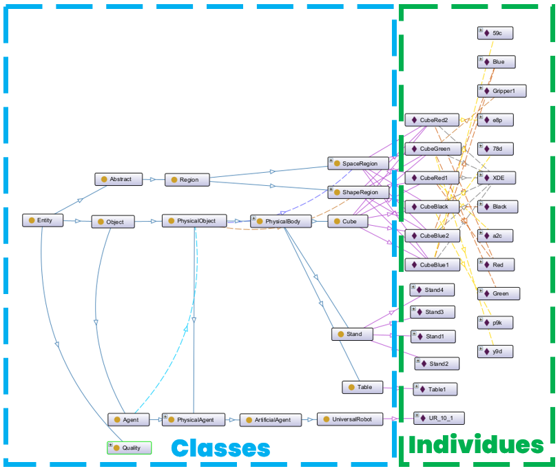
    - Classes -> Design ->Creation de la strucure cf model base engineering
    - Indiviudues -> setup -> Boite vides
    - Data -> Run -> remplissage des boites vides
- Grace au reasonner et au regles -> IA

#### d) But du projet

- Schema démonstration RUN 3IA
- Début
  - 
- Objectif
  - 
- Explications
- Comment elle a été creer ?
- List des diffenetes objects individues -> Classes
- Listes des differentes chose a faire attention : Data Properties, Objectes Properties, rules
  - 
- Explications
- Schema FeedBack Loop
  - 
- Explications
- Demonstration avec le Digital Twin XDE : Vidéos
  - Demander la vidéo à Raphaël

## II - Ontologie : la base de connaissance

### 1) Nos Besoins justifiant une ontologie + intrdoction au ontologies

- Qu'est ce qu'une ontologie ?
  - 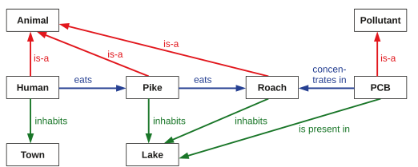
  - Exemple de mon cas tres simple sur protege
  - 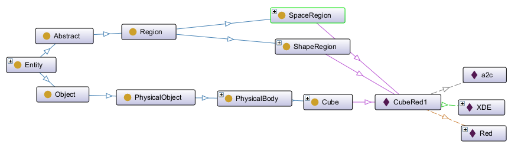
  - Explication de l'exmple du cube rouge
    - Cubered indiviude
    - id :a2c
    - DT xde
    - color Red
    - Class cube > PB> PO>Object > entity
  - Rappel des concepts
- Pourquoi une ontologie ?
  - Lisible par la machine et par les humains
  - Manipulation de données Sémantique
  - Raisonneur ontologique -> Valider et Inférer la connaissance
  - Règles basés sémantique : SWRL (Semantic Web Rule Language)
    - Introduction rapide au SWRL
  - Base de connaissance commune : Upper Ontologie

### 2) Choix du OWL

- 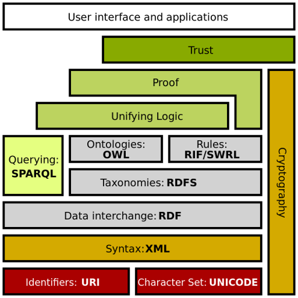
- Autre choix que le OWL :
  - OntoUML
  - First Order Logic
  - ....
- Facile
- Protege
- Upper Ontologie, presentation upper section IV)I)b)
- Communauté
- base sur xml -> extension facile + connaissance de l'equipe

### 3) Qu'est ce qu'on veut faire avec notre moteur ontologique

- Manipuler l'ontologie (S'appuyer sur les schémas du haut)
  - lire les classes / individues / Data Properties / Object Properties
  - Créer des classes / individues / Data Properties / Object Properties
- Raisonner
- Appliquer les regles SWRL
- Pouvoir etre utiliser avec ROS
- Rapidité pour robot

#### a) Protege

- 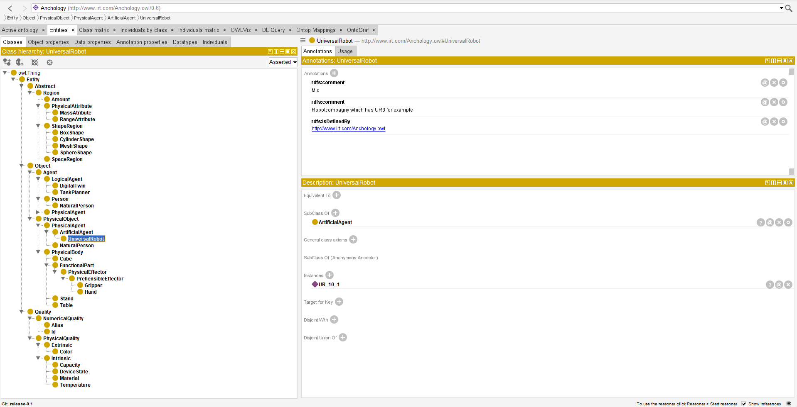
- 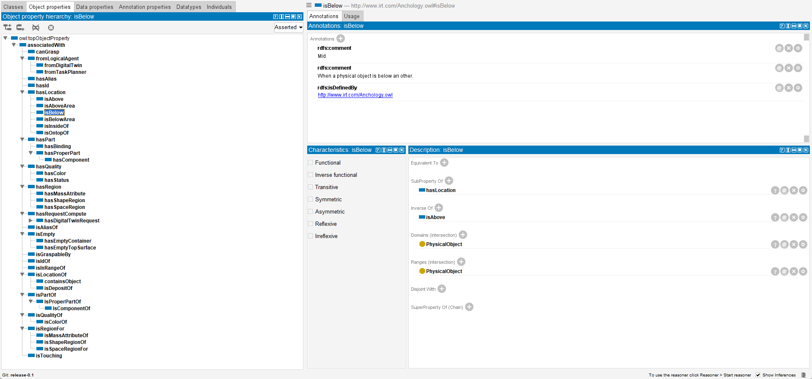
- 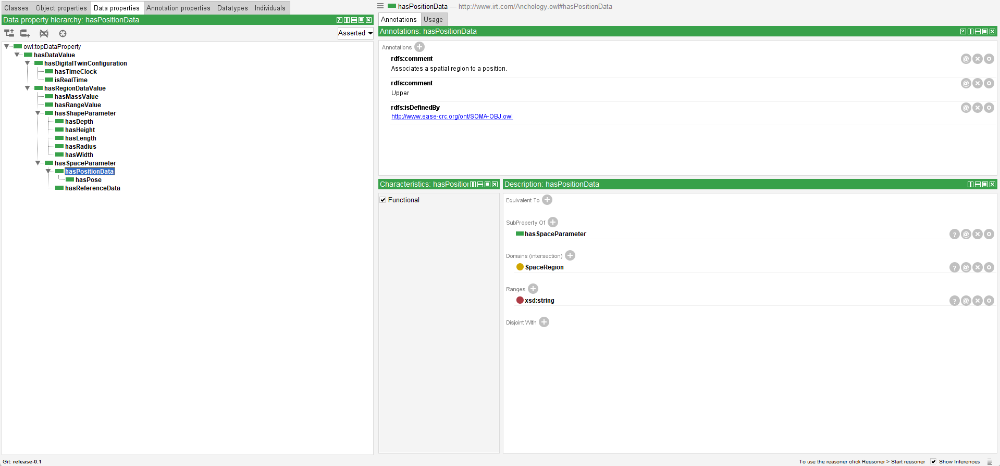
- 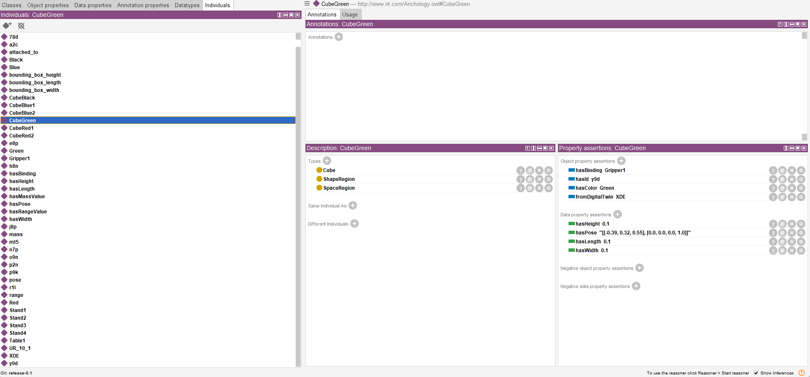
- Atouts
  - visualisation
    - Tout les figures on ete fait avec ontograph de protege
  - creation
  - on peut tout faire
  - Plugin
  - SWRL
  - ...
- Defauts
  - Programme -> pas ROS
- Conclusion
  - Programme majeur dans le devellopement d'une ontologie

#### b) OWLAPI / Jena

owlapi : https://github.com/owlcs/owlapi
Jena : https://github.com/apache/jena

- Atouts
  - Api sur lequel repose Protege
  - La plus utilise pour manipulé du OWL
- Defauts
  - Lent, demande beaucoup de ressource
  - Complexe
  - 'java'
- Conclusion
  - NON

#### c) Ontologenius

https://sarthou.github.io/ontologenius/

- 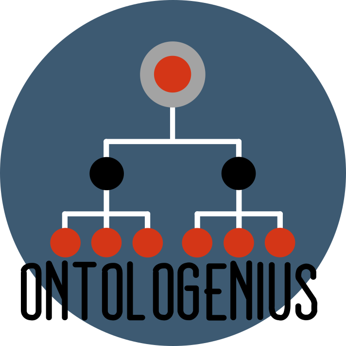
- Atouts
  - Developper par un proche de la team
  - penser pour la robotique
  - Rapide (Benchmark)
  - Python / C++
  - ROS2
  - Developpement Actif
  - Devloppement sous forme de plugin => contribution "facile"
- Defauts
  - Pas de SWRL
  - Manque de reasonner avec SWRL
  - Documentation pas super clair
  - ...
- Conclusion
  - Une solution a garder l'oeil
  - Pas garder par manque de SWRL
  
#### d) Owlready2

https://owlready2.readthedocs.io/en/latest/

- Atouts
  - Python
  - Actif dans le developpment
  - Reasonner pellet/HermiT
  - Rapide (Benchmark)
  - expressif
  - agile
  - On peut tout faire
  - Documentation + livre
  - API tres complete
- Defauts
  - Pas assez rapide a cause du reasonner java pellet
  - Documentation + livre incomplete das mon use case
- Conclusion
  - Moteur Ontologique garder garce au python, sa simplicité, et reasonner pellet

#### e) KnowRob

https://knowrob.org/

- Atouts
  - Université Bremen
  - relire Article
- Defauts
  - relire Article
- Conclusion
  - NON

#### f) Autre moteur d'ontologie

- Cowl
  - https://github.com/sisinflab-swot/cowl
  - Atouts
    - lightweight
    - C++
    - -developpemet actif
  - Defauts
    - Pas de reasonner du tout
  - Conclusion
    - NON
- ORO
  - https://www.openrobots.org/wiki/oro-ontology
  - OpenRobots Common Sense Ontology
  - Atouts
    - CNRS Sarthou
    - C++
  - Defauts
    - Pas de reasonner du tout
    - Plus dev depuis 2012
  - Conclusion
    - NON
- Armor RDS
  - https://github.com/EmaroLab/armor
  - Atout
    - Penser Ros Docker
  - Defauts
    - Plus Dev depuis 2016
    - Juste un Test
    - Pas de raisonner
  - NON

Donc choix de owlready2.

## III - Algorithme

### 1) Presentation Algorithme

#### a) Algoritme Simple Septembre

- Algoritme Global
  - 
  - Apres la perception reel > DT
  - Appuie sur les differents DT
  - Anchoring
  - Task Planner > creer des behanvior tree grace a des goal
- Algortime Local (Duplex DT)
  - 
  - modifier mettre des fleches doubles
- Comment on ils été pensé ?
- Quels sont les problemes ?

#### b) Algoritme Linéaire

- 
- Extension des premier algoritme avec la notion d'ontologie
- Comment a il été pensé ?
  - Import ontology
  - evolution de l'ontology en differentes phase 
    - Design
    - Setup
    - Run
  - Interaction avec DT et TP et Ontology
- Quels sont les problemes ?
  - Trop linéaire

### 2) Algoritme : Ontology Manager

- 

#### a) Besoins

- Squidly Compatible
  - 
- MAPE-K compatible
  - 
- Decentralisation
- Penser Node Ros + Behavior Tree
- Modulable
  - learner
  - viewpoint
  - substracter
  
#### b) Presenatation de l'algoritme

- 
- Superposition des bloc = dependance plugin
- Explications (Bien détailler)

#### c) Réduction de Ontology Manager dans le cadre du projet

- Pourquoi?
  - Simplifier
  - Manque de temps
  - Experimentation
  - Penser pour pouvoir etre evolutif
  - Creation du noyaux
- Quels Blocs Garder
  - Les plus essentiel
    - interaction avec le DT RUN
    - interaction avec le TP
    - Population Setup mais âs automatique grace a des fichier
    - Design: creation de l'ontology de base pas auto grace a protege
- Schema :
  - 

### 3) Algorithme réduit : Algoritme implémenté

#### a) Explications de l'algoritme

- Design : Création de l’ontologie vide d’individue
- Setup : Remplie l’ontologie avec les individues et les informations des processus (Task Planner, Digital Twin)
- Run :(Boucle temps réel) : Ajoute les data properties et met à jour les relations en temps réel

#### b) SYSML

- 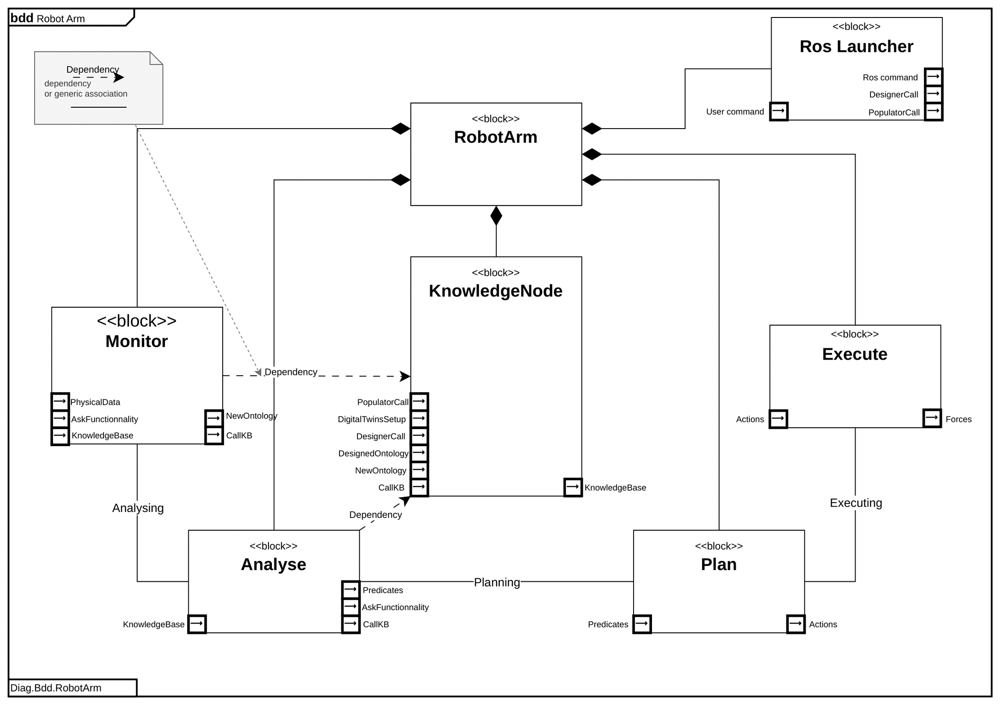
- Annexe
- Comment a il été creer ?
  - Idée de decentralisé
  - Creaetion de plein de petite fonction simple
  - Reste dans l'idée du mapek
  - Le plus compatible avec SQUIDLY
- [Le mettre a jour ?]

#### c) Implementation ROS Squidly

- Diagramme de sequence
  - Ontology Manager
    - 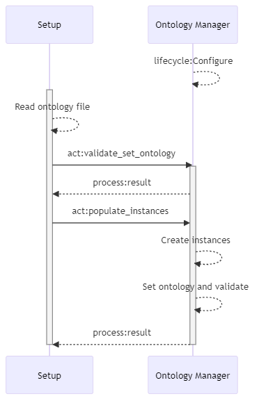
  - Integrator
    - 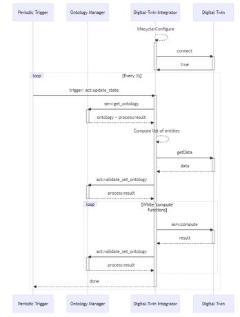
  - Reader
    - 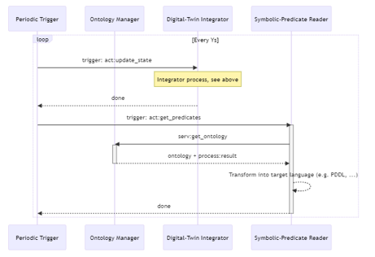
- Explication du knowlege domain
- Explication des path
- Explication du overwrite etc...

## IV - Implementation

L'implementation a été fait dans un premier temos avec des script python independent de ros/Squidly puis ensuite implemente dedans.

### 1) Design

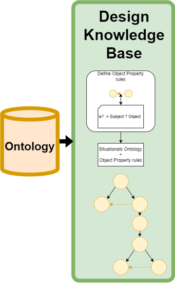

#### a) Role du design

- Creer une ontologie de base qui a :
  - une base ontologique
  - qui convient à la situations
  - qui convient au domaine
  - qui convient aux node utiliséq
- Montrer le bloc Design
  - [Ontology manager Design](figures/Ontology_Manager_Design.png)
- Expliquer les étapes

#### b) Choix de l'Upper Ontologie

- C'est quoi une upper ontologie ?
- Pourqupi ?
- Listes des Upper Ontologies :
  - IEEE1872 based on Cora & SUMO
    - IEEE Standard Ontologies for Robotics and Automation
    - https://github.com/srfiorini/IEEE1872-owl
    - Description : +/-
      - (-) manquait je trouve la possiblité d'ajouter des objet simple telle un cube une table
        - Plus en dev
      - (+) fait pour la robotique autmatic et cognitive
  - SUMO
    - https://www.ontologyportal.org/
    - Suggested Upper Merged Ontology
    - Description : +/- 
    - (+) veru big upper ontology
    - (-) Too big, too complexe
      - not owl
  - UFO
    - https://ontouml.readthedocs.io/en/latest/intro/ufo.html
    - Unified Foundational Ontology
    - based on Dolce, GFO, ontoClean
    - Description : +/-
      - (+)Doctorant au CEA
      - (-) OntoUML
  - ROSETTA
    - https://github.com/jacekmalec/Rosetta_ontology
    - ontology of industrial robotics devices and robotic skills
    - Description : +/-
      - (+) Ontology for skill
      - (-) No notion of object
        - very complex
        - already filled
  - DUL
    - DOLCE+DnS Ultralite
    - http://ontologydesignpatterns.org/wiki/Ontology:DOLCE+DnS_Ultralite
    - ontology for modeling either physical or social contexts
  - DOLCE
    - DOLCE: A Descriptive Ontology for Linguistic and Cognitive Engineering
    - http://www.loa.istc.cnr.it/dolce/overview.html
    - Description : +/-
  - SOMA
    - 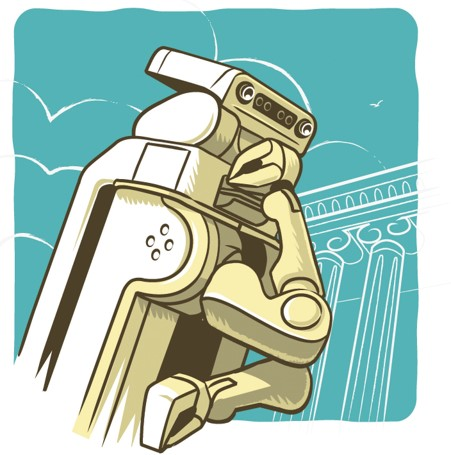
    - based on DUL
    - Description : +/-
      - (+) :
      - SOMA : The Socio-physical Model of Activities (SOMA) est une approche de modélisation ontologique pour les agents robotiques autonomes effectuant des activités de manipulation quotidiennes.
      - EASE-CRC et IAI University of Bremen
      - Notions : Objets, Agent, Qualité (dépend de l’environnement), Régions, Goal, Tasks, Sentiments
      - Basé sur DOLCE
Je choisi SOMA car notions

#### c) Présentation de SOMA

- Université de Bremen
- Laboratoir de IA
- Cognitive Robotic
- Social
- Goal
- ...

#### d) Modification de SOMA

- Refait SOMA en enlevant des relation car marche pas avec pellet penser pour HermiT
- Substract avec seulement ce dont j'ai besoin
- Toujours compatible Soma

#### e) Ajout du Mid et du Domain

##### i) Mid ajout de la compatibilité avec les autres Node

- Compatiblité avec le DT
- Compatibilité avec le Task Planner
- interactions ave  differents processus

##### ii) Domain

- Ajout pour le domain robotics
- Dependre des dituations

Transition : Ajout des individues -> Setup + Run

#### f) Comment le Design/domain est fait ?

- Design fait à la main avec protege
- Load par l'ontology manager lors du ros launch

### 2) Setup

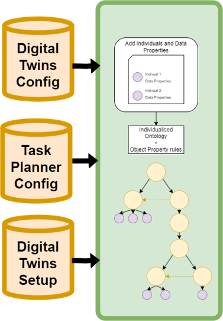

#### a) Role du setup

- Populer l'ontologie avec :
  - les individue initial
  - les configuration des nodes associé :
    - Digital Twin
    - Task Planner
  - Alias
  - Populer l’ontologie : Ajouts des individues
    - Ajout des Id des Digital Twin
    - Ajout des propriétés non décrites dans les DT
    - Fait avec un fichier de configuration JSON
  - Ajouter la configuration du Digital Twin
    - Ajout de l’individue, des Alias, le temps réel
  - Ajouter la configuration du Task Planner
    - Ajout de l’individue, des Alias
  
#### b) Comment le populator est fait ?

- Parsing de fichier json prélablement fait
- Ajout avec le moteur ontologique
- Ontology manager lors du ros launch ou peut etre activer a n'import quelle moment
- Explication de processus dans le code avec owlready2

### 3) Run Time (boucle temps réel)

#### a) Role du run time

- Etre run time pour que l'ontology représente en live le réel
- Boucle Integrator
  - 
- Boucle Reader
  - 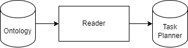

#### b) Integrateur

##### i) Role de l'intégrateur

- C'est un peu juste ça l'"anchoring"
- Remplir l'ontologie avec des data propertie que le DT lui donne
- Puis les faire valider par l'ontology manager pour qui infere pour creer des relations

##### ii) Comment l'intégrateur est fait ?

- parsing d'un message ros
- Ajout dans l'ontology avec le moteur ontologique
- Parler du processus dans le code avec les Alias/ID
- Parler du processus dans le code pour ecraser les Data properties
- Parler du processus dans le code pour que ce soit automatique peut importe la properties a remplir si il y a bien un alias
- Puis les faire valider par l'ontology manager pour qui infere pour creer des relations

#### c) Rulemaker

##### i) Role du rulemaker

- Ajout de regles python pour palier au probleme du SWRL
- Regles Numpy
- regles geometrique
  
##### ii) Comment le rulemaker est fait ?

- recherche et ajout dans l'ontology avec owlready 2
- Parler des regles
- Parler du processus de supression de propriété fausse

#### d) Reasonner

##### i) Role du reasonner

- assure la coherence de l'ontology
- infere
- Applique les SWRL rules
- pellet / Hermit

##### ii) Comment le reasonner est fait ?

- Ligne python avec owlready2

#### e) Reader

##### i) Role du reader

- Transformer les fait sémantique de l'ontologie en predicat pour un Task Planner
- peut transforer pour plusieurs Task Planner PDDL / HTN / ...

##### ii) Comment le reader est fait ?

- Parsing avec owlready 2 : [[ObjectProperty, Subject, Object], ...]

### 4) Conclusion de l'implémentation

- En python ça marche ! cad :
  - on arrive a recuperer l'ontology desogn  de faire un raisonnement dessus puis de lui donner un no et un path dans l'implemenation
  - puis on arrive a populer l'ontology avec unecore un raisonnement
  - puis on arrive a remplir l'ontolgy autant de fois que l'on veut sans que cela casse l'ontolgy
  - il y a achasue fois l'etape de raisonnement et donc l'etape de d'aapplication des regles et d'inference

## V - Apprentissages, critiques, autres chose à explorer

### 1) Ontologies

- Apprentissages :
  - Domain ou l'IRT a appris et mis en pratique
  - Application de Semantique dans la robotique
  - relation symbolique
  - Domain/Mid layer super : permet la compatiblité avec plusieurs processus avec les import ontologie incrayable
- Critiques :
  - Il faut etre expert en ontologies
    - je n'ai moi meme pas ete rigoureux pour des expert en ontologie avec soma
  - interaction avec compliqué
  - domain tres vasste et donc peu clair
  - Schema : 2 ontologie differentes meme signification
- Autres chose à explorer :
  - Algo pour chaque regle (revient a ce qu'on fait avec rule maker) + SQL/DataLake

### 2) SWRL

- Apprentissages :
  - Pas de négations
  - pas de division dans aucun des reasonner
  - dependant du reasonner
  - peu utilisé par la communaute
  - déconseille de l'utilse par la communauté
  - long pour ecrire des regle
  - pas de var tmp
  - pas possble d'ajouter et/ou d'écraser des Data properties
- Critiques :
- Autres chose à explorer :
  - Biblioteque de regle python en axioms

### 3) Moteur Ontologique

- Apprentissages :
  - Owlready super bien mais utilise pellet qui est lent
- Critiques :
- Autres chose à explorer :
  - Maintenant plus de SWRL + maj de ontologenius pour ROS 2 => essayé Ontologenius

### 4) Algorithme

- Apprentissages :
  - Fiable
  - Pas Asez complet
  - Pas eu le temps de suffisament le test
  - Simple
  - Grosse dependance de la qualité de l'ontologie de base
- Critiques :
- Autres chose à explorer :

### 5) Design

- Apprentissages :
- Critiques :
  - Pas automatique
  - Pas import
  - En un seul bloc
- Autres chose à explorer :
  - Le faire automatiquement en dennat une UPPER les differentes nodes ros pour definir les domain ontologies a prendre et le tout avec des import

### 6) Setup

- Apprentissages :
- Critiques :
- Autres chose à explorer :
  - Creer les ficheir de setup de node automatiquement
  - Creer le fichier des setup de la situation automatiquement

### 7) Intergrator

- Apprentissages :
- Critiques :
- Autres chose à explorer :

### 8) RuleMaker

- Apprentissages :
- Critiques :
- Autres chose à explorer :

### 9) Reasonner

- Apprentissages :
  - Pellet c'est bien
  - pellet c'est puissant
  - Pellet necessaire pour SWRL
- Critiques :
- Autres chose à explorer :
  - On pourrait essayer Hermit ou essayer un resonner tiers plus rapide => Ontologenius

### Moi-même

- Apprentissages :
  - Sorti de ma zone de confort
  - la recherche
  - le langage formel
  - la semantique
  - entreprise
  - cognitive robotique
  - Ontologie
- Critiques :
  - mauvaise estimation du temps
- Autres chose à explorer :

### Suite a donner au projet

- Travailler avec d'autre département en interne car il y a un certains nombre de projet interne avec l'utilisation de soit des jumeaux numérique ou soit des ontologies dans differents domaines
- Implémentation du design avec des imports d'ontologie 
- Utilisation de plusieurs upper ontologie
- automatisé le setup
- Un expert en ontologie viennent rectifier les errerus dans l'ontologies et ajoute de l'intelligence dans les algorithme

## Conclusion

Reponse au question de la problematique et de l'introduction

- Anchoring permet de faire plus que de la robotique cognitive
  - Jumeau numérique dans tous les domaines, l’Anchoring permet d’utiliser de la sémantique dans plein de domaine
- Logique sémantique
- Permet à diffèrent processus de s’appuyer sur des données sémantiques et donc formel

L'implémentation a été reussi on peut ainsi utiliser une base de connaissance ontologique qui repose sur des fait symbolique qui est dynamique et qui est capable de comprendre le monde de réflechir dessus et de partager cette connaissance avec d'autre processus.
