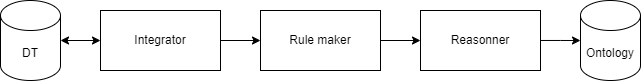

# Plan détaillé : Anchoring

- [Plan détaillé : Anchoring](#plan-détaillé--anchoring)
  - [Résumé (Français)](#résumé-français)
  - [Résumé (Anglais)](#résumé-anglais)
  - [Mots-clés](#mots-clés)
  - [Introduction](#introduction)
  - [I - Présentation du Projet](#i---présentation-du-projet)
    - [1) Cadre du projet en entreprise](#1-cadre-du-projet-en-entreprise)
      - [a) Présentation de l'entreprise](#a-présentation-de-lentreprise)
      - [b) Présentation de l'environnement du projet](#b-présentation-de-lenvironnement-du-projet)
    - [2 - Objectif du projet](#2---objectif-du-projet)
      - [a) Projet de recherche](#a-projet-de-recherche)
      - [b) Domaine du projet](#b-domaine-du-projet)
    - [3) Présentation du projet : Ancrage Sémantique (Anchoring)](#3-présentation-du-projet--ancrage-sémantique-anchoring)
      - [a) Introduction au projet](#a-introduction-au-projet)
      - [b) Terminologies](#b-terminologies)
      - [c) Présentation Anchoring avec remplissage d'une ontologie](#c-présentation-anchoring-avec-remplissage-dune-ontologie)
      - [d) But du projet](#d-but-du-projet)
  - [II - Ontologie : la base de connaissances](#ii---ontologie--la-base-de-connaissances)
    - [1) Nos Besoins justifiant une ontologie + introduction aux ontologies](#1-nos-besoins-justifiant-une-ontologie--introduction-aux-ontologies)
    - [2) Choix du OWL](#2-choix-du-owl)
    - [3) Qu'est-ce qu'on veut faire avec notre moteur ontologique](#3-quest-ce-quon-veut-faire-avec-notre-moteur-ontologique)
      - [a) Protege](#a-protege)
      - [b) OWLAPI / Jena](#b-owlapi--jena)
      - [c) Ontologenius](#c-ontologenius)
      - [d) Owlready2](#d-owlready2)
      - [e) KnowRob](#e-knowrob)
      - [f) Autre moteur d'ontologie](#f-autre-moteur-dontologie)
  - [III - Algorithme](#iii---algorithme)
    - [1) Présentation Algorithme](#1-présentation-algorithme)
      - [a) Algorithme Général](#a-algorithme-général)
      - [b) Algorithme Linéaire](#b-algorithme-linéaire)
    - [2) Algorithme : Ontology Manager](#2-algorithme--ontology-manager)
      - [a) Besoins](#a-besoins)
      - [b) Présentation de l'algorithme](#b-présentation-de-lalgorithme)
      - [c) Réduction de Ontology Manager dans le cadre du projet](#c-réduction-de-ontology-manager-dans-le-cadre-du-projet)
    - [3) Algorithme réduit : Algorithme implémenté](#3-algorithme-réduit--algorithme-implémenté)
      - [a) Explications de l'algorithme](#a-explications-de-lalgorithme)
      - [b) SYSML](#b-sysml)
      - [c) Implémentation ROS Squidly](#c-implémentation-ros-squidly)
  - [IV - Implémentation](#iv---implémentation)
    - [1) Design](#1-design)
      - [a) Rôle du design](#a-rôle-du-design)
      - [b) Choix de l'Upper Ontologie](#b-choix-de-lupper-ontologie)
      - [c) Présentation de SOMA](#c-présentation-de-soma)
      - [d) Modification de SOMA](#d-modification-de-soma)
      - [e) Ajout du Mid et du Domaine](#e-ajout-du-mid-et-du-domaine)
        - [i) Mid ajout de la compatibilité avec les autres Nodes](#i-mid-ajout-de-la-compatibilité-avec-les-autres-nodes)
        - [ii) Domaine](#ii-domaine)
      - [f) Comment le Design/domaine est fait ?](#f-comment-le-designdomaine-est-fait-)
    - [2) Setup](#2-setup)
      - [a) Rôle du setup](#a-rôle-du-setup)
      - [b) Comment le populator est fait ?](#b-comment-le-populator-est-fait-)
    - [3) Run Time (boucle temps réel)](#3-run-time-boucle-temps-réel)
      - [a) Rôle du run time](#a-rôle-du-run-time)
      - [b) Integrateur](#b-integrateur)
        - [i) Rôle de l'intégrateur](#i-rôle-de-lintégrateur)
        - [ii) Comment l'intégrateur est fait ?](#ii-comment-lintégrateur-est-fait-)
      - [c) Rulemaker](#c-rulemaker)
        - [i) Rôle du rulemaker](#i-rôle-du-rulemaker)
        - [ii) Comment le rulemaker est fait ?](#ii-comment-le-rulemaker-est-fait-)
      - [d) Reasonner](#d-reasonner)
        - [i) Rôle du reasonner](#i-rôle-du-reasonner)
        - [ii) Comment le reasonner est fait ?](#ii-comment-le-reasonner-est-fait-)
      - [e) Reader](#e-reader)
        - [i) Rôle du reader](#i-rôle-du-reader)
        - [ii) Comment le reader est fait ?](#ii-comment-le-reader-est-fait-)
    - [4) Conclusion de l'implémentation](#4-conclusion-de-limplémentation)
  - [V - Apprentissages, critiques, autres choses à explorer](#v---apprentissages-critiques-autres-choses-à-explorer)
    - [1) Ontologies](#1-ontologies)
    - [2) SWRL](#2-swrl)
    - [3) Moteur Ontologique](#3-moteur-ontologique)
    - [4) Algorithme](#4-algorithme)
    - [5) Design](#5-design)
    - [6) Setup](#6-setup)
    - [7) Intergrator](#7-intergrator)
    - [8) RuleMaker](#8-rulemaker)
    - [9) Reasonner](#9-reasonner)
    - [Moi-même](#moi-même)
    - [Suite à donner au projet](#suite-à-donner-au-projet)
  - [Conclusion](#conclusion)

## Résumé (Français)

Ancrage symbolique (Anchoring) processus qui transforme des données de Jumeaux numériques (fonctionnels ou géométriques) en une sémantique intelligente à l'aide d'une base de données. Cette base de données est une ontologie et représente une base de connaissances. L'ontologie peut être lue pour retourner des prédicats sous la forme *Sujet* *Action* *Complément*. De plus, grâce à un raisonneur ontologique, on peut vérifier la cohérence de l'ontologie, faire des inférences (créer des relations) et appliquer des règles. On peut ainsi dire que l'Anchoring raisonne et donc que c'est un processus intelligent. Grâce à l'Anchoring, l'ontologie est un savoir sémantique sur lequel d'autres applications peuvent interagir. Dans mon cas d'application, la robotique cognitive, le planificateur de taches (Task Planner) et le jumeau numérique (Digital Twin) interagissent avec l'ontologie. Les Digital Twins permettent de remplir l'ontologie grâce à l'Anchoring (intégrateur), et l'Anchoring peut demander aux Digital Twins des informations supplémentaires si nécessaire. Le Task Planner reçoit les prédicats que fournit l'Anchoring pour créer une liste d'action pour résoudre un objectif. L'Anchoring est temps réel, et donc peut s'apercevoir de problème dans les actions. De plus, l'Anchoring est fondé sur une ontologie créée avec une upper ontologie pour permettre à ce que ce savoir sémantique soit partageable. Nous avons une proposition de l'algorithme établi à partir de MAPE-K (Monitor, Analyse, Plan, Execute, Knowledge), décentralisé pour utiliser la base de connaissances. Ainsi, on a une proposition d'implémentation avec une upper ontologie : SOMA et un moteur ontologique : owlready2 avec python et ROS. L'exemple présenté est en interaction avec un jumeau numérique et le planificateur de tâches. En conclusion, nous avons une première proposition d'implémentation et surtout, nous avons appris sur les technologies utilisées et nous avons aussi des voix d'améliorations.

## Résumé (Anglais)

Symbolic anchoring (Anchoring) process that transforms Digital Twin data (functional or geometric) into intelligent semantics using a database. This database is an ontology and represents a knowledge base. The ontology can be read to return predicates in the form *Subject* *Action* *Complement*. In addition, thanks to an ontological reasoner, we can check the consistency of the ontology, make inferences (create relationships) and apply rules. We can thus say that Anchoring reasons and therefore that it is an intelligent process. Thanks to Anchoring, the ontology is semantic knowledge on which other applications can interact. In my application case, cognitive robotics, the Task Planner and the Digital Twin interact with the ontology. The Digital Twins make it possible to fill in the ontology thanks to the Anchoring (integrator), and the Anchoring can ask the Digital Twins for additional information if necessary. The Task Planner receives the predicates that the Anchoring provides to create a list of actions to resolve an objective. Anchoring is real time, and therefore can detect problems in actions. In addition, Anchoring is based on an ontology created with an upper ontology to allow this semantic knowledge to be shareable. We have a proposal for the algorithm established from MAPE-K (Monitor, Analysis, Plan, Execute, Knowledge), decentralized to use the knowledge base. Thus, we have an implementation proposal with an upper ontology: SOMA and an ontological engine: owlready2 with python and ROS. The example shown is interacting with a digital twin and the task scheduler. In conclusion, we have a first implementation proposal and above all, we have learned about the technologies used and we also have voices for improvements.

## Mots-clés

- Cognitive Robotics
- Robot intélligent
- Symbolique
- Sémantique
- Ontologie
- Raisonnement
- Problème complexe
- Ancrage
- Ancrage Symbolique
- langage formel
- langage de non programmation
- Jumeaux numérique (Digital Twin : DT)

## Introduction

Avec l'avènement de plus en plus présente de l'automatisation et de la robotique, on veut maintenant que cette robotique soit intelligente et donc qu'elle est une compréhension de son environnement et une capacité d'apprentissage. Nous avons déjà la compétence de créer des tâches grâce à des behaviour tree qui représentent des tâches complexes avec un regroupement de taches de plus en plus simple. On est aussi capable grâce à des planificateurs de tâches qui avec un plan du monde et un objectif peuvent donner une liste de tâches à faire pour résoudre l'objectif indiqué. Nous pouvons aussi représenter le monde réel grâce à des jumeaux numériques. On cherche désormais à créer des algorithmes munis d'intelligence qui peuvent comprendre le monde et capable de raisonnement. Un algorithme capable de faire ceci serait apte à comprendre n'importe quelle situation de monde et aussi capable de raisonnement. Il pourrait ainsi servir à n'importe quelles autres processus informatiques dans n'importe quel domaine, le domaine de la finance, le domaine de la publicité sur le web par exemple. Ce serait donc un algorithme apte à manipuler des bases de connaissances et capable aussi d'en créer. Par conséquent, on voudrait pouvoir remplacer les systèmes experts par des règles et des raisonnements établis sur des faits symboliques. Cet algorithme sera ainsi l'intelligence qui manque dans la robotique actuelle.

<!--- Problématique -->
Dans ce mémoire, le projet a été fait dans un but de recherche dans un laboratoire de recherche en France au CEA. Nous allons essayer de créer un processus nommé l'***Anchoring*** pour *Ancrage Symbolique* qui va créer et manipuler une base de connaissances. Cette base de connaissances sera une base de données ontologiques. Le but de l'anchoring sera de créer une ontologie base. Puis, de remplir l'ontologie avec les données du jumeau numérique qui représente le monde. L'ontologie appliquera des fonctionnements du monde présent dans sa connaissance, et de la réflexion sur ces données pour s'assurer de la compréhension du monde. Ensuite, cette base de connaissances intelligente sera utilisée par le planificateur de tâches qui a besoin d'une représentation du monde réfléchi et symbolique.

<!--- Introduction au plan -->
Je vais d'abords présenter le projet et son environnement, puis expliquer les technologies et les outils lier aux ontologies, ensuite présenter la création de l'algorithme de l'anchoring. Et enfin, je parlerai de comment on a implémenté l'anchoring. Je présenterai différentes critiques et des voies d'amélioration du projet et ses possibles suites avant de conclure.

## I - Présentation du Projet

### 1) Cadre du projet en entreprise

#### a) Présentation de l'entreprise

- CEA : centre de recherche français
- CEA palaiseau
- LIST DILS
- EPIC : centre de recherche public avec but de transfert **technologique**
- CEA = Projet européen + projet entreprise + projet interne

#### b) Présentation de l'environnement du projet

- LSEA : Laboratoire de conception des systèmes embarqués et autonomes
- Modele based engineering
- SQUIDLY : projet de mes tuteurs -> architecture généraliste pour les robots intelligents
- Intelligence Robot Team : Raphaël, Matteo, Luis, Jianyong
- Moonshot : projet intern

### 2 - Objectif du projet

#### a) Projet de recherche

- Comment utiliser une base de données intelligente
- S'inspirer du model based engineering
- Découvrir les technologies dans le domaine des ontologies et des règles ontologiques (SWRL)
- Découvrir comment faire de la robotique avec des ontologies
- Faire des conclusions sur les technologies et les pistes recherchées : les points positifs et les points négatifs
- langage de non-programmation -> sortir la connaissance experte du code et le transformer en connaissance modélisée dans une ontologie -> exploitable, réutilisable, étudiable
- Première itération
- Faire des erreurs pour apprendre
- Faire un premier Anchoring pour SQUIDLY et les autres projets

#### b) Domaine du projet

- SQUIDLY : architecture généraliste pour la robotique
- Robotique cognitive
  - Qu'est-ce que c'est ?
  - Qu'est-ce que cela implique ?
- Lier des données géométriques et fonctionnelles (jumeaux numériques) à une base de données Symbolique, et donc SÉMANTIQUE pour faire des raisonnements fonctionnels, et donc intelligence

### 3) Présentation du projet : Ancrage Sémantique (Anchoring)

#### a) Introduction au projet

- Schéma : Perception -> Planning -> Acting
  - 
  - Perception : Capteurs -> **Jumeaux numériques** (Géométrique/Fonctionnel)
  - Planification : ***Anchoring*** -> **Task Planner** -> execution layer
  - Action : Contrôleur -> Actuators
- Expliquer ce schéma :
  - Rôle de l'Anchoring : lier les data de digital dans une base de données intelligentes
  - Place de l'Anchoring : base de connaissances en amont de la capture de donnée et en aval de la prise de décision et de l'action
  - Aide à la décision basée sur des règles expertes (l'ontologie) et l'état du "système", telles que la prise de décision bancaire, le système de pub, les systèmes avec des jumeaux numériqués.*
  - Plusieurs Digital Twin : géométrique et fonctionnel cf b)

- Schéma : DT -> Anchoring -> Task Planner
  - 
  - Anchoring -> Knowledge Base : Ontology + rules
- Expliquer ce schéma

#### b) Terminologies

- Environnement
- Digital Twin - jumeaux numérique
  - Qu'est-ce que c'est ?
  - DT géométrique + exemples
  - DT fonctionnels + exemples
- Task Planner - Planificateur de taches
  - Goal
  - Task Plan
  - Qu'est ce que c'est ?
  - Exemples
- Ontologies (Développer cette partie) - mettre des captures ontograph et owlred
  - Qu'est ce que c'est ?
  - Semantique
  - Symbole
  - Individu
  - Object property
  - Data property
  - Regle
  - attribution
  - Class
  - Reasonner
  - Inferences
  - Illustrations

#### c) Présentation Anchoring avec remplissage d'une ontologie

- Schéma avec ontologie
  - Design
  - Setup
  - Run
- Ontologie base -> import pour l'augmentée ontologie situation -> ajout des individues <=> attribution
  - 
  - 
    - Classes -> Design -> Création de la structure cf model base engineering
    - Individues -> setup -> Boites vides
    - Data -> Run -> remplissage des boites vides
- Grace au raisonneur et aux règles -> Intelligence -> IA

#### d) But du projet

- Schéma démonstration RUN 3IA
- Début
  - 
- Objectif
  - 
- Explications
- Comment a-t-elle été créé ?
- Liste des différentes objects individues -> Classes
- Liste des différentes choses à faire attention : Data Properties, Objectes Properties, rules
  - 
- Explications
- Schéma FeedBack Loop
  - 
- Explications
- Démonstration avec le Digital Twin XDE : Vidéos
  - Demander la vidéo à Raphaël

## II - Ontologie : la base de connaissances

### 1) Nos Besoins justifiant une ontologie + introduction aux ontologies

- Qu'est-ce qu'une ontologie ?
  - 
  - Exemple de mon cas très simple sur protege
  - 
  - Explication de l'exemple du cube rouge
    - CubeRed1 individue
    - id : a2c
    - DT : xde
    - color : Red
    - Class : Cube > Physical Body > Physical Object > Object > Entity
  - Rappel des concepts
- Pourquoi une ontologie ?
  - Lisible par la machine et par les humains
  - Manipulation de données Sémantique
  - Raisonneur ontologique -> Valider et Inférer la connaissance
  - Règles basées sémantiques : SWRL (Semantic Web Rule Language)
    - Introduction rapide au SWRL
  - Base de connaissances commune : Upper Ontologie

### 2) Choix du OWL

- 
- Autre choix que le OWL :
  - OntoUML
  - First Order Logic
  - ....
- Facile
- Protege
- Upper Ontologie, présentation upper section IV)I)b)
- Communauté
- Base sur XML -> extension facile + connaissance de l'équipe

### 3) Qu'est-ce qu'on veut faire avec notre moteur ontologique

- Manipuler l'ontologie (S'appuyer sur les schémas du haut)
  - lire les classes / individues / Data Properties / Object Properties
  - Créer des classes / individues / Data Properties / Object Properties
- Raisonner
- Appliquer les règles SWRL
- Pouvoir être utiliser avec ROS
- Rapidité pour robot

#### a) Protege

- 
- 
- 
- 
- Atouts
  - visualisation
    - Toutes les figures ont été faites avec ontograph de protege
  - creation
  - on peut tout faire
  - Plugin
  - SWRL
  - ...
- Defauts
  - Programme -> pas ROS
- Conclusion
  - Programme majeur dans le développement d'une ontologie

#### b) OWLAPI / Jena

OWLAPI : <https://github.com/owlcs/owlapi>

Jena : <https://github.com/apache/jena>

- Atouts
  - Api sur lequel repose Protege
  - La plus utilise pour manipuler du OWL
- Defauts
  - Lent, demande beaucoup de ressource
  - Complexe
  - 'java' (plus compliqué à utiliser que C++ ou Python avec ROS et peu de connaissance personnelle)
- Conclusion
  - NON

#### c) Ontologenius

<https://sarthou.github.io/ontologenius/>

- 
- Atouts
  - Développer par un proche de la team
  - penser pour la robotique
  - Rapide (Benchmark)
  - Python / C++
  - ROS2
  - Développement Actif
  - Développement sous forme de plugin => contribution "facile"
- Defauts
  - Pas de SWRL
  - Manque de raisonneur avec SWRL
  - Documentation pas super clair
  - ...
- Conclusion
  - Une solution à garder l'œil
  - Pas garder par manque de SWRL
  
#### d) Owlready2

<https://owlready2.readthedocs.io/en/latest/>

- Atouts
  - Python
  - Actif dans le developpment
  - Raisonneur pellet/HermiT
  - Rapide (Benchmark)
  - expressif
  - agile
  - On peut tout faire
  - Documentation + livre
  - API très complete
- Defauts
  - Pas assez rapide à cause du raisonner java pellet
  - Documentation + livre incomplet dans mon use case
- Conclusion
  - Moteur Ontologique gardé grâce au python, sa simplicité et raisonneur pellet

#### e) KnowRob

<https://knowrob.org/>

- Atouts
  - Université Bremen
  - relire Article
- Defauts
  - relire Article
- Conclusion
  - NON

#### f) Autre moteur d'ontologie

- Cowl
  - <https://github.com/sisinflab-swot/cowl>
  - Atouts
    - lightweight
    - C++
    - Développement actif
  - Defauts
    - Pas de raisonneur du tout
  - Conclusion
    - NON
- ORO
  - <https://www.openrobots.org/wiki/oro-ontology>
  - OpenRobots Common Sense Ontology
  - Atouts
    - CNRS Sarthou
    - C++
  - Defauts
    - Pas de raisonneur du tout
    - Plus dev depuis 2012
  - Conclusion
    - NON
- Armor RDS
  - <https://github.com/EmaroLab/armor>
  - Atout
    - Penser ROS Docker
  - Defauts
    - Plus Dev depuis 2016
    - Juste un Test
    - Pas de raisonner
  - NON

Par conséquent : choix d'owlready2.

## III - Algorithme

### 1) Présentation Algorithme

#### a) Algorithme Général

- Algorithme Global
  - 
  - Après la perception réelle > DT
  - Appuie sur les différents DT
  - Anchoring
  - Task Planner > créer des behaviour tree grâce à des goals
- Algorithme Local (Duplex DT)
  - 
  - Intéractions en double sens
- Comment ont-ils été pensés ?
- Quels sont les problèmes ?

#### b) Algorithme Linéaire

- 
- Extension du premier algorithme avec la notion d'ontologie
- Comment a-t-il été pensé ?
  - Import ontology
  - Évolution de l'ontologie en différentes phases
    - Design
    - Setup
    - Run
  - Interaction avec DT et TP et Ontology
- Quels sont les problèmes ?
  - Trop linéaire

### 2) Algorithme : Ontology Manager

- 

#### a) Besoins

- Squidly Compatible
  - 
- MAPE-K compatible
  - 
- Decentralisation
- Penser Node Ros + Behaviour Tree
- Modulable
  - learner
  - viewpoint
  - substracter
  
#### b) Présentation de l'algorithme

- 
- Superposition des blocs = dépendance / plugin /import
- Explications (Bien détailler)

#### c) Réduction de Ontology Manager dans le cadre du projet

- Pourquoi ?
  - Simplifier
  - Manque de temps
  - Experimentation
  - Penser pour pouvoir être evolutif
  - Création du noyau
- Quels Blocs Garder
  - Les plus essentiels
    - interaction avec le DT RUN
    - interaction avec le TP
    - Population Setup mais pas automatique grâce à des fichiers
    - Design : création de l'ontologie base pas automatique grâce à protege
- Schéma :
  - 

### 3) Algorithme réduit : Algorithme implémenté

#### a) Explications de l'algorithme

- Design : Création de l’ontologie vide d’individue
- Setup : Remplie l’ontologie avec les individues et les informations des processus (Task Planner, Digital Twin)
- Run : (Boucle temps réel) : Ajoute les data properties et actualise les relations en temps réel

#### b) SYSML

- 
- Annexe
- Comment a-t-il été créé ?
  - Idée de decentralisé
  - Création d'une multitude de petites fonctions simples
  - Reste dans l'idée du mapek
  - Le plus compatible avec SQUIDLY
- [Le mettre à jour ?]

#### c) Implémentation ROS Squidly

- Diagramme de sequence
  - Ontology Manager
    - 
  - Integrator
    - 
  - Reader
    - 
- Explication du knowledge domain
- Explication des path
- Explication du overwrite etc...

## IV - Implémentation

L'implémentation a été faite dans un premier temps avec des scriptes python indépendant de ROS/Squidly puis implémenté dedans.

### 1) Design

#### a) Rôle du design

- Créer une ontologie base qui a :
  - une base ontologique
  - qui convient aux situations
  - qui convient au domaine
  - qui convient aux nodes utilisé
- Montrer le bloc Design
  - [Ontology manager Design](figures/Ontology_Manager_Design.png)
- Expliquer les étapes

#### b) Choix de l'Upper Ontologie

- C'est quoi une upper ontologie ?
  - Meta/Upper
  - Mid
  - Domaine
- Pourquoi ?
- Listes des Upper Ontologies :
  - IEEE1872
    - Basé sur Cora & SUMO
    - IEEE Standard Ontologies for Robotics and Automation
    - <https://github.com/srfiorini/IEEE1872-owl>
    - Description : +/-
      - (-) manquait, je trouve la possibilité d'ajouter des objets simples tel un cube, une table
        - Plus en dev
      - (+) fait pour la robotique automatique et cognitive
  - SUMO
    - <https://www.ontologyportal.org/>
    - Suggested Upper Merged Ontology
    - Description : +/-
    - (+) very big upper ontology
    - (-) Too big, too complexe
      - not owl
  - UFO
    - <https://ontouml.readthedocs.io/en/latest/intro/ufo.html>
    - Unified Foundational Ontology
    - Basé sur Dolce, GFO, ontoClean
    - Description : +/-
      - (+) Doctorant au CEA
      - (-) OntoUML
  - ROSETTA
    - <https://github.com/jacekmalec/Rosetta_ontology>
    - ontology of industrial robotics devices and robotic skills
    - Description : +/-
      - (+) Ontology for skill
      - (-) No notion of object
        - very complex
        - already filled
  - DUL
    - DOLCE+DnS Ultralite
    - <http://ontologydesignpatterns.org/wiki/Ontology:DOLCE+DnS_Ultralite>
    - ontology for modeling either physical or social contexts
  - DOLCE
    - DOLCE: A Descriptive Ontology for Linguistic and Cognitive Engineering
    - <http://www.loa.istc.cnr.it/dolce/overview.html>
    - Description : +/-
  - SOMA
    - 
    - Basé sur DUL
    - Description : +/-
      - (+) :
      - SOMA : The Socio-physical Model of Activities (SOMA) est une approche de modélisation ontologique pour les agents robotiques autonomes effectuant des activités de manipulation quotidiennes.
      - EASE-CRC et IAI University of Bremen
      - Notions : Objets, Agent, Qualité (dépend de l’environnement), Régions, Goal, Tasks, Sentiments
      - Basé sur DOLCE

Je choisis SOMA car notions

#### c) Présentation de SOMA

- Université de Bremen
- Laboratoire de IA
- Cognitive Robotic
- Expliquer / justifier pourquoi le choix de SOMA
- Social
- Goal
- ...

#### d) Modification de SOMA

- Refait SOMA en enlevant des relations, car ne marche pas avec pellet, pensé pour HermiT
- Substrat avec seulement ce dont j'ai besoin
- Toujours compatible Soma

#### e) Ajout du Mid et du Domaine

##### i) Mid ajout de la compatibilité avec les autres Nodes

- Compatibilité avec le DT
- Compatibilité avec le Task Planner
- interactions avec  différents processus

##### ii) Domaine

- Ajout pour le domaine robotique
- Dépendre des situations

Transition : Ajout des individues -> Setup + Run

#### f) Comment le Design/domaine est fait ?

- Design fait à la main avec protege
- Load / Chargé par l'ontology manager lors du ros launch

### 2) Setup

#### a) Rôle du setup

- Populer l'ontologie avec :
  - les individue initial
  - les configurations des nodes associé :
    - Digital Twin
    - Task Planner
  - Alias
  - Peuplement de l’ontologie : Ajouts des individues
    - Ajout des Id des Digital Twin
    - Ajout des propriétés non décrites dans les DT
    - Fait avec un fichier de configuration JSON
  - Ajouter la configuration du Digital Twin
    - Ajout des individues, des Alias, le temps réel
  - Ajouter la configuration du Task Planner
    - Ajout des individues, des Alias
  
#### b) Comment le populator est fait ?

- Parsing de fichier json préalablement fait
- Ajout avec le moteur ontologique
- Ontology manager lors du ros launch ou peut-être activé à n'import quel moment
- Explication de processus dans le code avec owlready2

### 3) Run Time (boucle temps réel)

#### a) Rôle du run time

- Être run time pour que l'ontologie représente en live le réel
- Boucle Integrator
  - 
- Boucle Reader
  - 

#### b) Integrateur

##### i) Rôle de l'intégrateur

- C'est un peu juste ça l'"anchoring"
- Remplir l'ontologie avec des data properties que le DT lui donne
- Puis les faire valider par l'ontologie manager pour qui infère pour créer des relations

##### ii) Comment l'intégrateur est fait ?

- parsing d'un message ros
- Ajout dans l'ontologie avec le moteur ontologique
- Parler du processus dans le code avec les Alias/ID
- Parler du processus dans le code pour écraser les Data properties
- Parler du processus dans le code pour que ce soit automatique, peu importe les propriétés à remplir s'il y a bien un alias
- Puis les faire valider par l'ontology manager pour qui infère pour créer des relations

#### c) Rulemaker

##### i) Rôle du rulemaker

- Ajout de règles python pour palier aux problèmes du SWRL
- Règles Numpy
- Règles géometrique
  
##### ii) Comment le rulemaker est fait ?

- Recherche et ajout dans l'ontology avec owlready 2
- Parler des règles
- Parler du processus de suppression de propriété fausse

#### d) Reasonner

##### i) Rôle du reasonner

- Assure la cohérence de l'ontology
- Infère
- Applique les SWRL rules
- pellet / Hermit

##### ii) Comment le reasonner est fait ?

- Ligne python avec owlready2

#### e) Reader

##### i) Rôle du reader

- Transformer les fait sémantique de l'ontologie en prédicats pour un Task Planner
- Peut transformer pour plusieurs Task Planner PDDL / HTN / ...

##### ii) Comment le reader est fait ?

- Parsing avec owlready 2 : [[ObjectProperty, Subject, Object], ...]

### 4) Conclusion de l'implémentation

- En python ça marche ! cad :
  - on arrive à récupérer l'ontologie base de faire un raisonnement dessus puis de lui donner un nom et un path dans l'implémentation
  - puis on arrive à peupler l'ontologie, et puis, on raisonne dessus
  - puis on arrive à remplir l'ontologie autant de fois que l'on veut sans que cela casse l'ontologie
  - il y a, à chaque fois l'étape de raisonnement, et donc, l'étape d'application des règles et d'inférences

## V - Apprentissages, critiques, autres choses à explorer

### 1) Ontologies

- Apprentissages :
  - Domaine ou l'Intelligence Robotic Team a appris et mis en pratique
  - Application de Sémantiques dans la robotique
  - relation symbolique
  - Domaine/Mid layer super : permet la compatibilité avec plusieurs processus avec les imports ontologies
- Critiques :
  - Il faut être expert en ontologies
    - Je n'ai moi-même pas été rigoureux pour des experts en ontologie avec soma pour pouvoir utiliser mes algorithmes
  - interaction avec compliqué
  - Domaine de recherches très vaste, et donc peu clair
  - Schéma : 2 ontologies différentes, même signification en terme individues
  - 
- Autres choses à explorer :
  - Algo pour chaque règle (revient à ce qu'on fait avec rule maker) comme un dictonnaire de règles / comme une librairie + SQL/Data Lake

### 2) SWRL

- Apprentissages :
  - Pas de négations
  - Pas de division dans aucun des reasonner
  - Dépendant du reasonner
  - Peu utilisé par la communaute
  - Déconseille de l'utiliser par la communauté
  - Long pour écrire des règles
  - Pas de var tmp
  - Pas possible d'ajouter et / ou d'écraser des Data properties
- Critiques :
- Autres choses à explorer :
  - Bibliothèques de règles python en axioms

### 3) Moteur Ontologique

- Apprentissages :
  - Owlready2 super bien, mais utilise pellet qui est lent dans notre cas
- Critiques :
- Autres choses à explorer :
- Essayer owlready2 avec hermiT
  - Maintenant plus de SWRL + maj de ontologenius pour ROS 2 => essayer Ontologenius

### 4) Algorithme

- Apprentissages :
  - Fiable
  - Pas assez complet
  - Pas eu le temps de suffisament le test
  - Simple
  - Grosse dépendance de la qualité de l'ontologie de base
- Critiques :
- Autres choses à explorer :

### 5) Design

- Apprentissages :
- Critiques :
  - Pas automatique
  - Pas import
  - En un seul bloc
- Autres choses à explorer :
  - Le faire automatiquement en donnant une UPPER les différentes nodes ros pour définir les domaines ontologies à prendre et le tout avec des imports

### 6) Setup

- Apprentissages :
- Critiques :
- Autres choses à explorer :
  - Créer les fichiers de setup de node automatiquement
  - Créer le fichier des setup de la situation automatiquement

### 7) Intergrator

- Apprentissages :
  - Le système d'Alias est vraiment bien, permet de faire automatiquement l'intégration et une haute compatibilité
- Critiques :
- Autres choses à explorer :

### 8) RuleMaker

- Apprentissages :
  - Utilisé l'API owlready2 avec les librairies python ça marches bien
- Critiques :
  - Après de multiples tentatives avec le SWRL dommage de ne pas pouvoir mettre les règles directement dans l'ontologie
- Autres choses à explorer :
  - DSL : domaine spécifique langage pour pouvoir mettre les règles dans l'ontologie
  - Dans un plus court termes, faire une librairie dépendante certes l'api ontologique, est je pense une bonne idée comme dit plus haut

### 9) Reasonner

- Apprentissages :
  - Pellet c'est bien
  - pellet c'est puissant
  - Pellet nécessaire pour SWRL
- Critiques :
  - Lent
  - Boite noir
- Autres choses à explorer :
  - On pourrait essayer Hermit ou essayer un raisonneur tiers plus rapide => Ontologenius

### Moi-même

- Apprentissages :
  - Sorti de ma zone de confort
  - la recherche
  - le langage formel
  - la semantique
  - entreprise
  - cognitive robotique
  - Ontologie
- Critiques :
  - mauvaise estimation du temps

### Suite à donner au projet

- Travailler avec d'autres départements en interne au CEA, car il y a une multitude de projets internes avec l'utilisation de, soit des jumeaux numériques ou soit, des ontologies dans différents domaines
- Implémentation du design avec des imports d'ontologie
- Utilisation de plusieurs upper ontologie
- Automatisé le setup
- Un expert en ontologie viennent rectifier les erreurs dans l'ontologie et ajouter de l'intelligence dans les algorithmes
- Regarder les choses à améliorer écrit plus haut

## Conclusion

Reponse au question de la problematique et de l'introduction

- Anchoring permet de faire plus que de la robotique cognitive
  - Jumeau numérique dans tous les domaines, l’Anchoring permet d’utiliser de la sémantique dans plein de domaine
- Logique sémantique
- Permet à diffèrent processus de s’appuyer sur des données sémantiques et donc formel

L'implémentation a été reussi on peut ainsi utiliser une base de connaissance ontologique qui repose sur des fait symbolique qui est dynamique et qui est capable de comprendre le monde de réflechir dessus et de partager cette connaissance avec d'autre processus.
