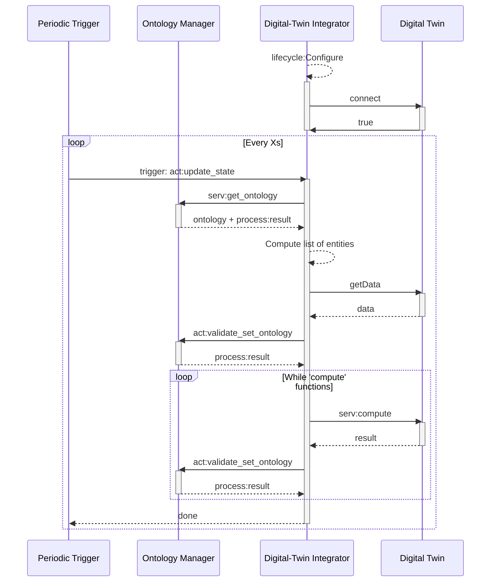
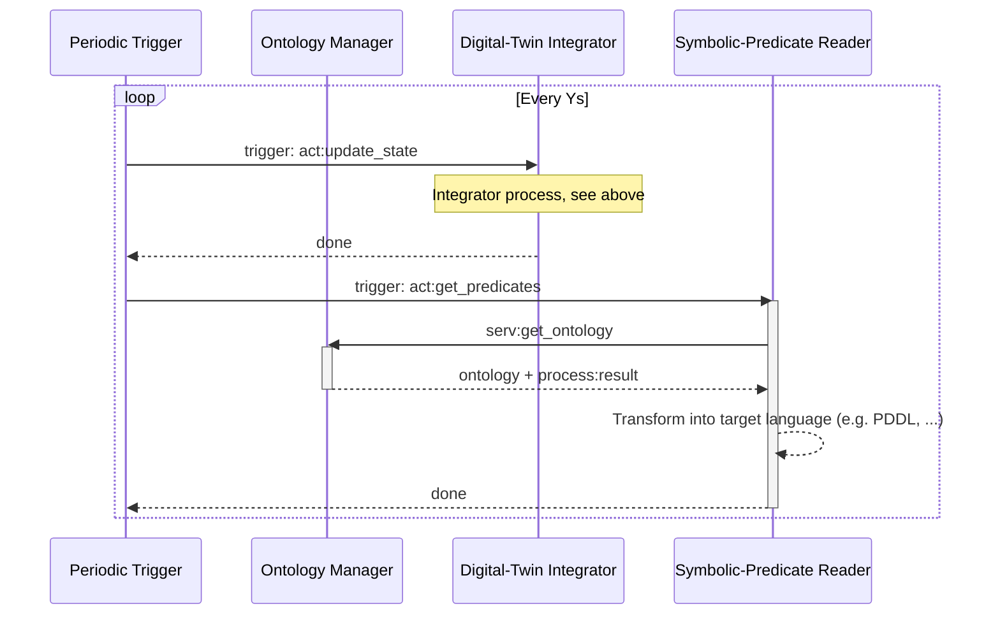

Anchoring
=========

Then anchoring nodes handles the integration of Digital Twin**s** data into the ontology of the system. It is then used to generate the 'problem' file for task planner for instance.

Digital-Twin Integrator
----------------------

This node handles the update of the ontology:

### Action server

The Digital-Twin Integrator provides the following action server:

`anchoring/digital_twin_integrator/update_state` which starts the process:
* Request:
  * string: knowledge_domain - (WIP) Selects the target ontology to update, is forwarded to the Ontology Manager. Currently not used.
* Feedback:
  * process:progress: Generic progress message. Currently implemented as a std_msgs/String with the name of the step: [listing_entities, getting_digital_twin_data, triggering_digital_twin_functions].
* Response:
  * process:result: Generic result message. Currently implemented as:
    * bool: success.
    * string: message.

Symbolic-Predicates Reader
-------------------------

The Symbolic-Predicates Reader (SPR) can be requested to transform the ontology into symbolic predicates in a target language. Different transformation libraries allow to export to different formats (e.g. PDDL, ...).

### Action server

`planning/get_predicates` which retrieves the current state from the ontology and computes the predicates:
* Request:
  * string: knowledge_domain - (WIP) Selects the target ontology to retrieve from, is forwarded to the Ontology Manager. Currently not used.
* Feedback:
  * process:progress: Generic progress message. Currently implemented as a std_msgs/String with the name of the step: [].
* Response:
  * process:result: Generic result message. Currently implemented as:
    * bool: success.
    * string: message.