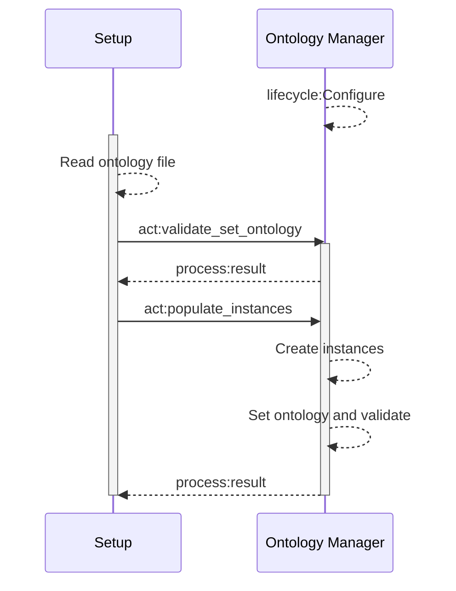

Ontology tool suite
==================

The tools for managing ontologies are:
* **Ontology manager**: the main node, handles the ontology live-memory storing. It allows to get and set the ontology. Each time we set the ontology it is validated, so the ontology stored is guaranteed to be consistent.
* **Populator**: loads the initial instances, in a one-off manner.

The overall sequence diagram is:



Ontology Manager
---------------

In the current version the ontology manager (OM), is a [squidly skill](#) that relies on [OwlReady2](https://owlready2.readthedocs.io/en/latest/) to store, manipulate and validate the ontology.

In a later version, the OM will store the ontology directly in memory.


### Action server

`ontology_manager/validate_set_ontology` which sets the target ontology with the new provided content if it is valid:
* Request:
  * string: knowledge_domain - (WIP) Selects the target ontology to update. Currently not used.
  * string: ontology - URL to the OWL2.0 ontology file (e.g. "file:///home/user/some/path/onto.owl").
* Feedback:
  * process:progress: Generic progress message. Currently implemented as a std_msgs/String with the name of the step: [validating, updating].
* Response:
  * process:result: Generic result message. Currently implemented as:
    * bool: success.
    * string: message.

`ontology_manager/get_ontology` to retrieve the complete ontology:
* Request:
  * string: knowledge_domain - (WIP) Selects the target ontology to update. Currently not used.
* Feedback:
  * process:progress: Generic progress message. Currently implemented as a std_msgs/String with the name of the step: [collecting, sending].
* Response:
  * string: ontology - URL to the OWL2.0 ontology file (e.g. "file:///home/user/some/path/onto.owl").
  * process:result: Generic result message. Currently implemented as:
    * bool: success.
    * string: message.

`ontology_manager/populate_instances` to create and set parameters of instances in the ontology.
* Request:
  * string: knowledge_domain - (WIP) Selects the target ontology to update. Currently not used.
  * string: instances - Stringified json content, see below.
* Feedback:
  * process:progress: Generic progress message. Currently implemented as a std_msgs/String with the name of the step: [parsing, updating, validating].
* Response:
  * process:result: Generic result message. Currently implemented as:
    * bool: success.
    * string: message.

The format for the populator should be:
```json
{
  "format_version": "1.0",
  "instances": [
    {
      "id": "BlueCube",
      "name": "blue cube",
      "setup_properties": {
        "type": "Cube",
        "color": "Blue",
        "material": "Plastic",
        "weight": 1.2
      },
      "dt_aliases": [
        {
          "digital_twin": "XDE",
          "dt_id": "object_157"
        },
        {
          "digital_twin": "MoveIt",
          "dt_id": "Cube122"
        }
      ]
    },
    {
      ...
    }
  ]
}
```


### Services

`ontology_manager/execute_owlready2_commands` to execute PYthon code with Owlready2 - WILL BE REPLACE LATER BY CLEANER INTERFACE:
* Request:
  * string: commands - stringified piece of python code to be executed by Owlready.
* Response:
  * string: output - output produced by Owlready.

`ontology_manager/get_knowledge` not implemented - Will allow to subset the ontology before retrieving it.
